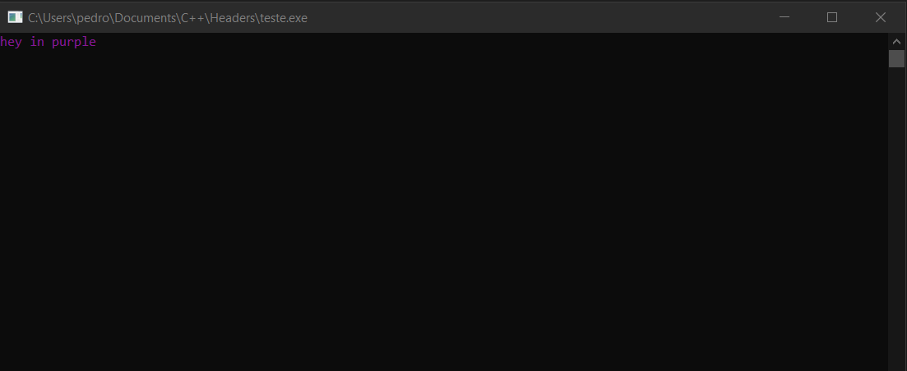

# C++ Colored Output
C/C++ header that makes your output colored 

## How to start using it
As any header file, just drop it in your project folder and ``#include "colors.h"``

## Usage
```cpp
#include "colors.h"
#include <iostream>

// color(int color, char* Message)
// default color is 7 (white)

int main(int argc, char const *argv[])
{
    std::cout << color(5, "hey in purple");
} 
```



## Available colors
- 1: Blue
- 2: Green
- 3: Cyan
- 4: Red
- 5: Purple
- 6: Yellow (Dark)
- 7: Default white
- 8: Gray/Grey
- 9: Bright blue
- 10: Brigth green
- 11: Bright cyan
- 12: Bright red
- 13: Pink/Magenta
- 14: Yellow
- 15: Bright white
Numbers after 15 are background colors

## Disclaimer
This header file is from [this website](https://www.cplusplus.com/forum/beginner/77879/). My purpose is just share this with people
